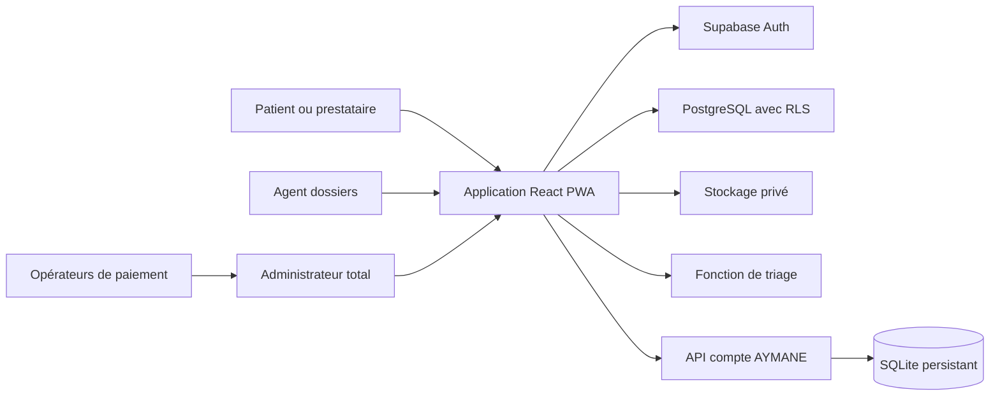

# Architecture AYMANE

## Objectif

AYMANE est une plateforme de santé mobile-first destinée au Sénégal. Elle relie patients, professionnels, structures sanitaires, pharmacies, laboratoires, agents de vérification et administrateurs, sans mélanger leurs responsabilités.

## Vue d'ensemble

## Composants

| Composant | Responsabilité |
| --- | --- |
| React + Vite | Parcours publics et authentifiés, PWA, vues mobiles et bureau |
| Supabase Auth | Sessions, récupération de mot de passe, MFA TOTP, niveau AAL2 |
| PostgreSQL | Dossiers, consultations, urgences, paiements, abonnements, portefeuille et audits |
| Row Level Security | Isolation des données par patient, prestataire et rôle administratif |
| Supabase Storage | Documents médicaux, justificatifs prestataires et pièces KYC privées |
| Edge Function triage | Orientation des symptômes avec détection des urgences |
| API Node | Synchronisation d'un compte durable et message de bienvenue |
| SQLite | Métadonnées minimales du compte, connexions et audit technique local |
| Nginx | SPA, cache des actifs, en-têtes de sécurité et proxy de l'API compte |

SQLite ne contient pas le dossier médical. Les données cliniques restent dans PostgreSQL avec politiques d'accès et journalisation.

## Frontières fonctionnelles

- Le patient gère son dossier, ses suivis, sa famille, ses paiements et ses partages.
- Le prestataire gère ses services, ses revenus, ses justificatifs et ses retraits.
- L'agent dossiers vérifie les candidatures et le KYC, demande des compléments et dépose un avis motivé.
- L'administrateur total attribue les rôles d'agent, décide des comptes, rapproche les paiements et autorise les retraits.
- Un lien médical public ne retourne qu'un résumé limité et expire automatiquement.

## Flux majeurs

### Création d'un compte prestataire

1. Le demandeur crée un compte et dépose son dossier.
2. L'agent vérifie les pièces.
3. Si nécessaire, il demande un complément ciblé.
4. Le demandeur répond et joint les nouvelles pièces.
5. L'agent clôt le complément et met à jour son avis.
6. L'administrateur total accepte ou refuse avec un motif.
7. L'acceptation attribue le rôle professionnel.

### Paiement d'un service

1. Le patient choisit un service et son moyen de paiement.
2. Une demande avec référence unique est créée.
3. L'administrateur rapproche la transaction opérateur.
4. La confirmation crée la facture et crédite le portefeuille du prestataire.
5. Le patient et le prestataire voient la facture.

### Retrait prestataire

1. Le prestataire valide son KYC et active le MFA.
2. Il choisit un compte de réception et un montant.
3. Le système réserve le montant et calcule la commission de 20 %.
4. L'administrateur motive sa décision.
5. Après envoi, il confirme la référence de paiement.

## Déploiement

Le conteneur `frontend` sert l'application et relaie `/api` vers le conteneur `backend`. Le volume `aymane-data` conserve SQLite. PostgreSQL et Storage sont gérés par Supabase. Voir [deployment.md](./deployment.md).
